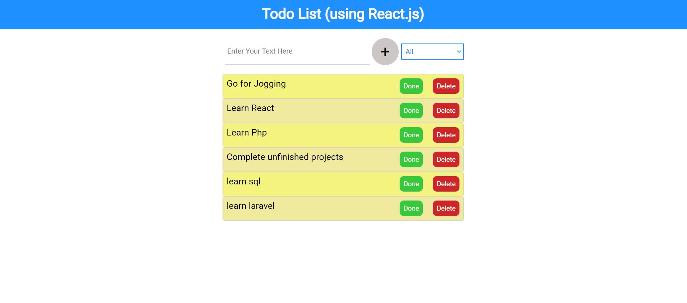

<h1>Todo List (using React.js)</h1>

Simple Todo List built using React js including filtering of todos according to their status,whether they are completed or uncompleted .The app currently stores the entered todo in to the browser local storage 

